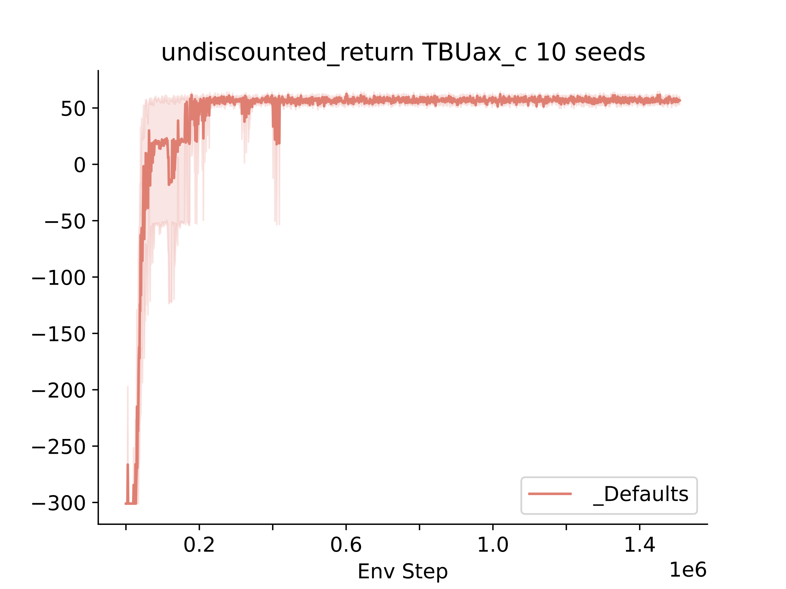
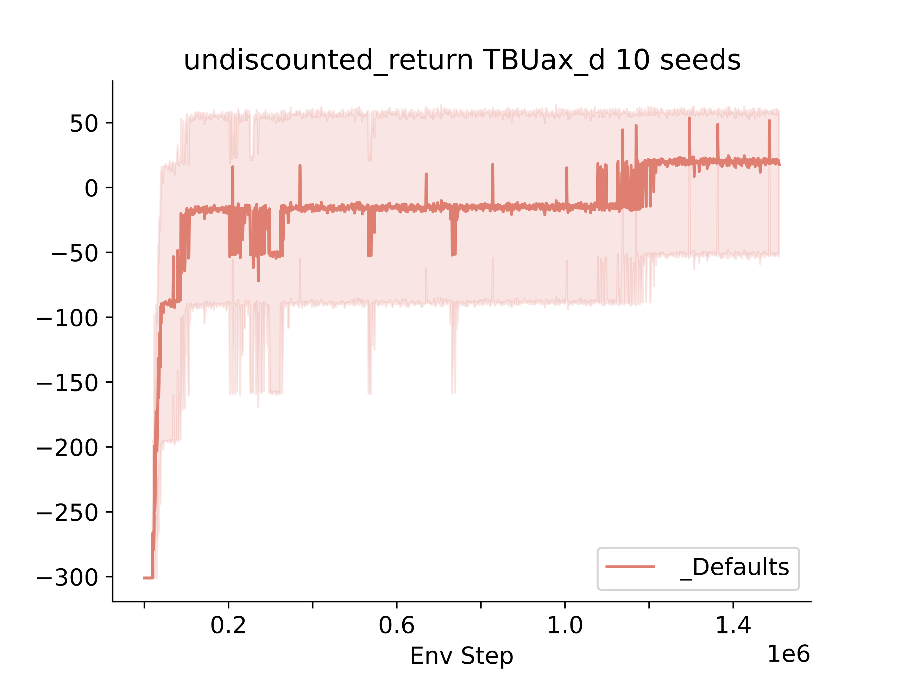

# TruckBackerUpper
Truck Backer Upper (TBU) is an environment for sequential decision making experiments. There are two versions
of this environment, the continous and the discrete version. 

## TBU Gym
This is an implementation of the TruckBackerUpper environment using the gymnasium API, both discrete and continous versions have gymnasium implementations. 

## TBU Jax
This is an implmentation of the TruckBackerUpper environment using in the style of gymnax environments. Both the continous and discrete verisons are implemented in this style. 

## Example1
This is an example of running SAC, as implemented by Stablebaselines3, on the Gymnasium Truck Backer Upper Continous environment. 

## Example2 
This is an example of running a random uniform policy on the gymnax TBU discrete environment.

## Tests
Removes randomness in the environments and runs them for 10k steps with random actions to check if they are equivalent. 
They are not perfectly equal due to precision differences between the versions, but they ought to be identitical aside 
from this. 

## Example Learning Curves 
TODO: Add PPO Learning Curves to this repo

#### SAC Results
Note, this SAC is using 20k exploration steps which helps a lot in this problem, so it's not to be expected by default SAC. 

SAC running on jax version of continuous TBU 

SAC running on jax version of discrete TBU

